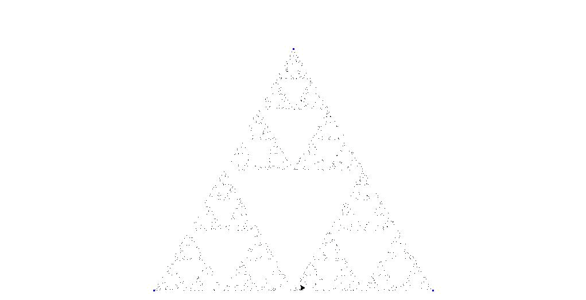

# Fractals

## Spierpinski triangle

1. Create a equilateral triangle
2. Place a random point inside the triangle
3. Take a random triangle edge
4. Place the point between the last point and the picked edge
Repeat 3 and 4 

